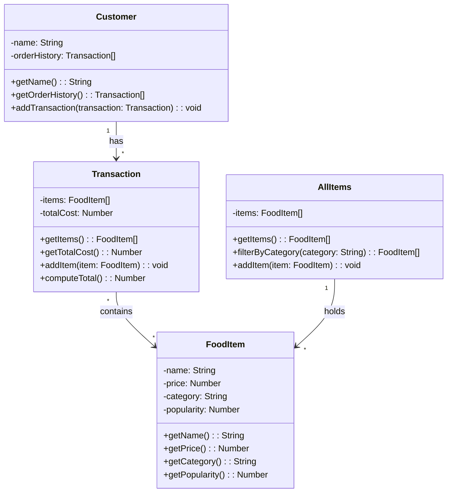

```mermaid  
classDiagram
    class Customer {
        -name: String
        -orderHistory: Transaction[]
        +getName(): String
        +getOrderHistory(): Transaction[]
        +addTransaction(transaction: Transaction): void
    }

    class FoodItem {
        -name: String
        -price: Number
        -category: String
        -popularity: Number
        +getName(): String
        +getPrice(): Number
        +getCategory(): String
        +getPopularity(): Number
    }

    class AllItems {
        -items: FoodItem[]
        +getItems(): FoodItem[]
        +filterByCategory(category: String): FoodItem[]
        +addItem(item: FoodItem): void
    }

    class Transaction {
        -items: FoodItem[]
        -totalCost: Number
        +getItems(): FoodItem[]
        +getTotalCost(): Number
        +addItem(item: FoodItem): void
        +computeTotal(): Number
    }

    Customer "1" --> "*" Transaction : has
    Transaction "*" --> "*" FoodItem : contains
    AllItems "1" --> "*" FoodItem : holds
```